# Service Mesh：下一代微服务

> 背景：这是2017年11月4日，QCon 2017年上海会议上的演讲实录，为PPT图片加文字内容整理。这是Service Mesh技术第一次在国内技术社区正式亮相。
>
> Slides下载：[PDF格式](http://www.servicemesh.cn/?/article/12)
>
> 作者：敖小剑

主持人：接下来分享的嘉宾是数人云资深架构师敖小剑老师，分享的主题是“Service  Mesh：下一代微服务”。

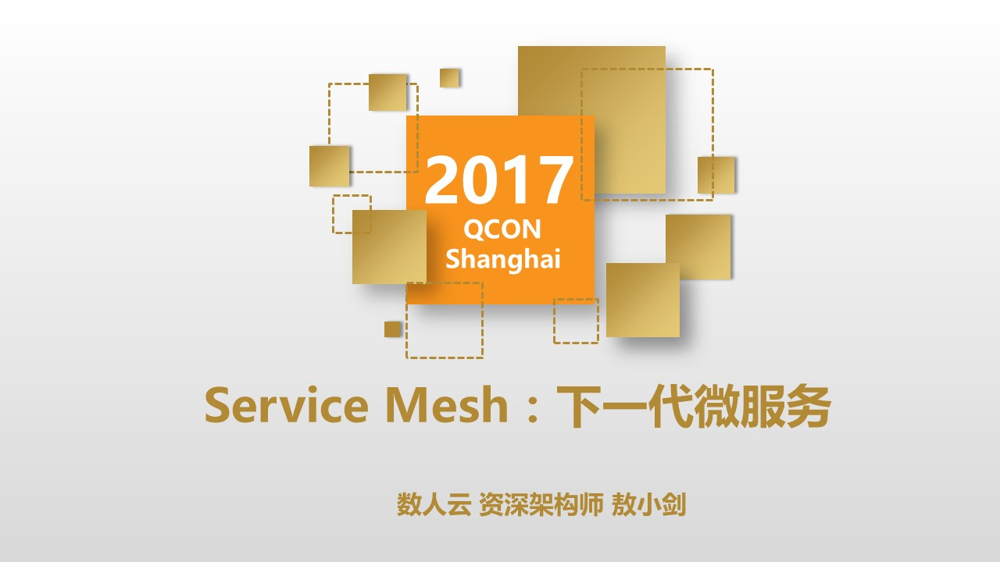

敖小剑：首先感谢这么多朋友来听我的演讲，今天我们分享的是Service Mesh，下一代微服务.我是敖小剑，来自数人云的资深架构师。

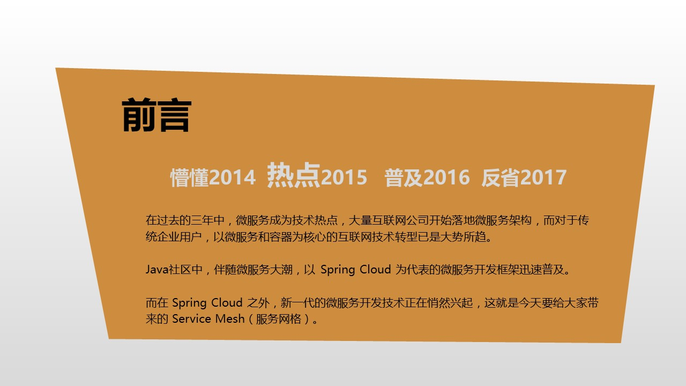

简单回顾一下过去三年微服务的发展历程。在过去三年当中，微服务成为我们的业界技术热点，我们看到大量的互联网公司都在做微服务架构的落地。也有很多传统企业在做互联网技术转型，基本上还是以微服务和容器为核心。

在这个技术转型中，我们发现有一个大的趋势，伴随着微服务的大潮，Spring Cloud微服务开发框架非常普及。而今天讲的内容在Spring Cloud之外，我们发现最近新一代的微服务开发技术正在悄然兴起，就是今天要给大家带来的Service Mesh/服务网格。

我做一个小小的现场调查，今天在座的各位，有没有之前了解过服务网格的，请举手。（备注：调查结果，现场数百人仅有3个人举手）

既然大家都不了解，那我来给大家介绍。首先，什么是Service  Mesh？然后给大家讲一下Service Mesh的演进历程，以及为什么选择Service Mesh以及为什么我将它称之为**下一代的微服务**，这是我们今天的内容。

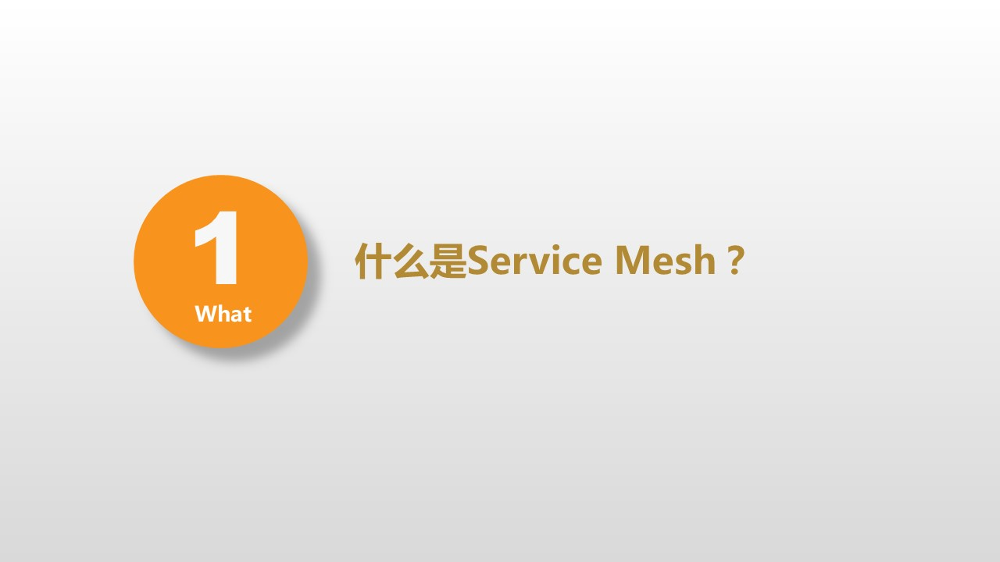

我们首先说一下Service Mesh这个词，这确实是一个非常非常新的名词，像刚才调查的，大部分的同学都没听过。

这个词最早使用由开发Linkerd的Buoyant公司提出，并在内部使用。2016年9月29日第一次公开使用这个术语。2017年的时候随着Linkerd的传入，Service  Mesh进入国内技术社区的视野。最早翻译为“服务啮合层”，这个词比较拗口。用了几个月之后改成了服务网格。后面我会给大家介绍为什么叫网格。

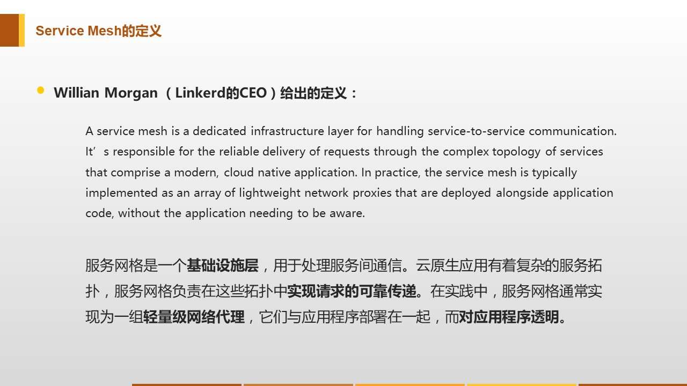

先看一下Service Mesh的定义，这个定义是由Linkerd的CEO William给出来的。Linkerd是业界第一个Service Mesh，也是他们创造了Service Mesh这个词汇的，所以这个定义比较官方和权威。

我们看一下中文翻译，首先服务网格是一个基础设施层，功能在于处理服务间通信，职责是负责实现请求的可靠传递。在实践中，服务网格通常实现为轻量级网络代理，通常与应用程序部署在一起，但是对应用程序透明。

这个定义直接看文字大家可能会觉得比较空洞，不太容易理解到底是什么。我们来看点具体的东西。

Service Mesh的部署模型，先看单个的，对于一个简单请求，作为请求发起者的客户端应用实例，会首先用简单方式将请求发送到本地的Service Mesh实例。这是两个独立进程，他们之间是远程调用。

Service Mesh会完成完整的服务间调用流程，如服务发现负载均衡，最后将请求发送给目标服务。这表现为Sidecar。

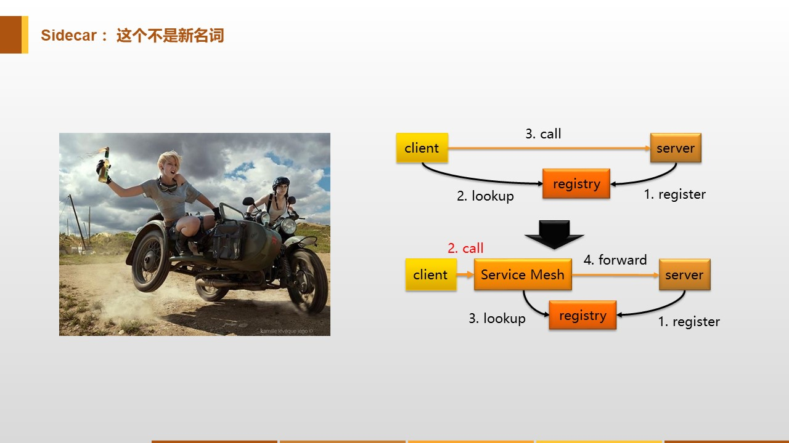

Sidecar这个词中文翻译为边车，或者车斗，也有一个乡土气息浓重的翻译叫做边三轮。Sidecar这个东西出现的时间挺长的，它在原有的客户端和服务端之间加多了一个代理。

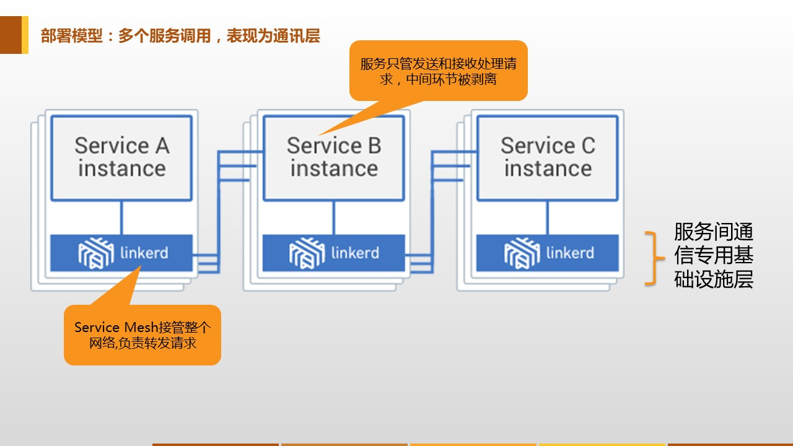

多个服务调用的情况，在这个图上我们可以看到Service Mesh在所有的服务的下面，这一层被称之为**服务间通讯专用基础设施层**。Service Mesh会接管整个网络，把所有的请求在服务之间做转发。在这种情况下，我们会看到上面的服务不再负责传递请求的具体逻辑，只负责完成业务处理。服务间通讯的环节就从应用里面剥离出来，呈现出一个抽象层。

如果有大量的服务，就会表现出来网格。图中左边绿色方格是应用，右边蓝色的方框是Service Mesh，蓝色之间的线条是表示服务之间的调用关系。Sidecar之间的连接就会形成一个网络，这个就是服务网格名字的由来。这个时候代理体现出来的就和前面的sidecar不一样了，形成网状。

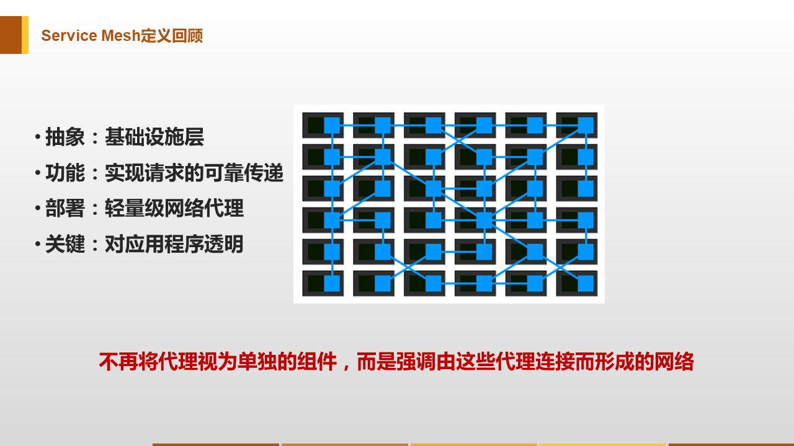

再来回顾前面给出的定义，大家回头看这四个关键词。首先第一个，服务网格是抽象的，实际上是抽象出了一个基础设施层，在应用之外。其次，功能是实现请求的可靠传递。部署上体现为轻量级的网络代理。最后一个关键词是，对应用程序透明。

大家注意看，上面的图中，网络在这种情况下，可能不是特别明显。但是如果把左边的应用程序去掉，现在只呈现出来Service Mesh和他们之间的调用，这个时候关系就会特别清晰，就是一个完整的网络。这是Service Mesh定义当中一个非常重要的关键点，和Sidecar不相同的地方：**不再将代理视为单独的组件，而是强调由这些代理连接而形成的网络**。在Service  Mesh里面非常强调代理连接组成的网络，而不像sidecar那样看待个体。

现在我们基本上把Service Mesh的定义介绍清楚了，大家应该可以大概了解什么是Service Mesh了。

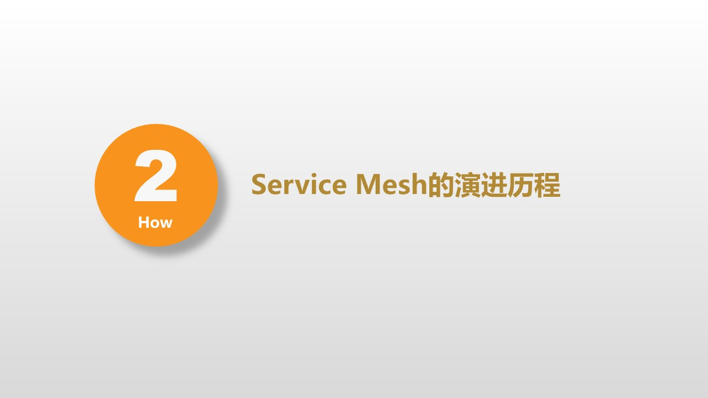

第二个部分和大家追溯一下Service Mesh的演进历程。要注意，虽然Service Mesh这个词汇直到2016年9才有，但是它表述的东西很早以前就出现了。

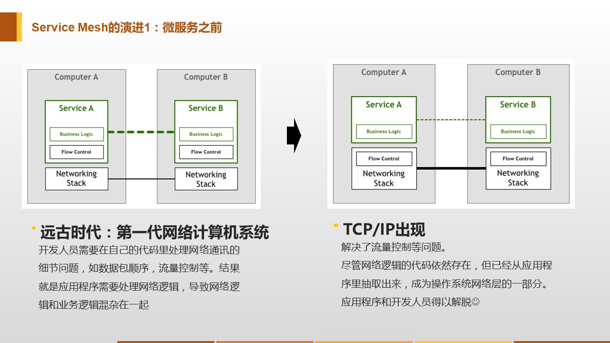

首先看“远古时代”，第一代网络计算机系统，最早的时候开发人员需要在自己的代码里处理网络通讯的细节问题，比如说数据包顺序、流量控制等等，导致网络逻辑和业务逻辑混杂在一起，这样是不行的。接下来出现了TCP/IP技术，解决了流量控制问题，从右边的图上可以看到，功能其实没发生变化：所有的功能都在，代码还是要写。但是，最重要的事情，流程控制，已经从应用程序里面抽出来了。对比左右两边的图，抽出来之后被做成了操作系统网络层的一部分，这就是TCP/IP，这样的话应用的结构就简单了。

现在写应有，就不用考虑网卡到底怎么发。在TCP/IP之后，这是完全不需要考虑的。上面说的是非常遥远的事情，大概发生在五十年前。

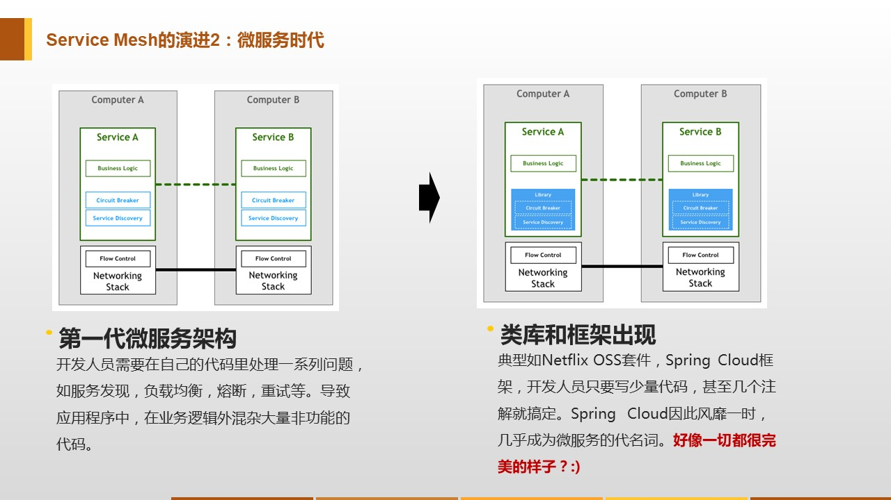

微服务时代也面临着类似的一些东西，比如说我们在做微服务的时候要处理一系列的比较基础的事情，比如说常见的服务注册、服务发现，在得到服务器实例之后做负载均衡，为了保护服务器要熔断/重试等等。这些功能所有的微服务都跑不掉，那怎么办呢？只能写代码，把所有的功能写进来。我们发现最早的微服务又和刚才一样，应用程序里面又加上了大量的非功能性的代码。为了简化开发，我们开始使用类库，比如说典型的Netflix OSS套件。在把这些事情做好以后，开发人员的编码问题就解决了：只需要写少量代码，就可以把这些功能实现。因为这个原因，最近这些年大家看到Java社区Spring Cloud的普及程度非常快，几乎成为了微服务的代名词。

到了这个地步之后，完美了吗？当然，如果真的完美了，那我今天就不会站在这里了:)

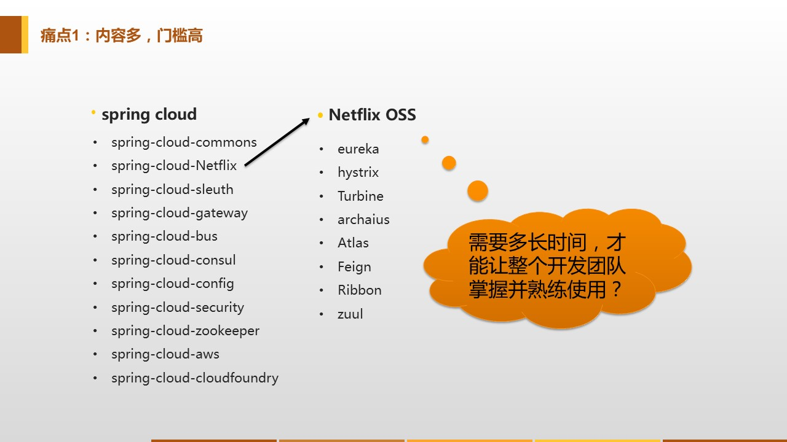

我们看这几个被称之为痛点的东西:内容比较多，门槛比较高。调查一下，大家学Spring Cloud，到你能熟练掌握，并且在产品当中应用，可以解决出现的问题，需要多长时间？一个星期够不够？大部分人一个星期是不够的，大部分人需要三到六个月。因为你在真实落地时会遇到各种问题，要能自己解决的话，需要的时间是比较长的。这里是Spring Cloud的常见子项目，只列出了最常见的部分，其中spring cloud netflix下还有netflix OSS套件的很多内容。要真正吃透Spring Cloud，需要把这些东西全部吃透，否则遇到问题时还会非常难受。

这么多东西，在座的各位相对来说学习能力比较强一点，可能一个月就搞定了，但是问题是你的开发团队，尤其是业务开发团队需要多久，这是一个很要命的事情：业务团队往往有很多比较初级的同事。

然后事情并不止这么简单，所谓雪上加霜，我们还不得不面对一堆现实。

比如说，我们的业务开发团队的强项是什么？最强的会是技术吗？不，通常来说我们的业务开发团队最强的是对业务的理解，是对整个业务体系的熟悉程度。

第二个事情，业务应用的核心价值是什么？我们辛辛苦苦写了这么多的微服务，难道是为了实现微服务吗？微服务只是我们的手段，我们最终需要实现的是业务，这是我们真正的目标。

第三个事情是，就微服务这个手段而言，有比学习微服务框架更艰巨的挑战。在做微服务的真正落地时，会有更深刻的理解。比如微服务的拆分，比如要设计一个良好的API，要保持稳定并且易于扩展，还有如果涉及到跨多个服务的数据一致性，大部分团队都会头疼。最后是康威定律，但凡做服务的同学最终都会遇到这个终极问题，而大多数情况下是欲哭无泪。

但是这些还没完，比你写一个新的微服务系统更痛苦的事情，是你要对旧有的系统进行微服务改造。

所有这些加在一起，还不够，还要再加一条，这条更要命：业务开发团队往往业务压力非常大，时间人力永远不足。说下月上线就是下月上线，说双十一促销就不会推到双十二。老板是不会管你有没有时间学习spring cloud的，也不会管你的业务团队能否搞得定微服务的方方面面。**业务永远看的是结果**。

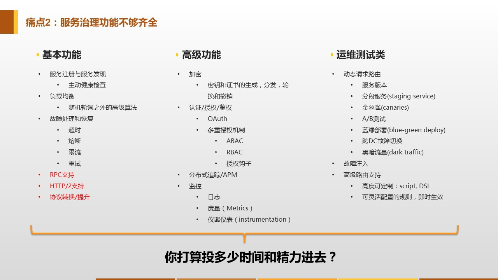

第二个痛点，功能不够，这里列出了服务治理的常见功能。而Spring Cloud的治理功能是不够强大的，如果把这些功能一一应对做好，靠Spring Cloud直接提供的功能是远远不够的。很多功能都需要你在Spring Cloud的基础上自己解决。

问题是你打算投入多少时间人力资源来做这个事情。有些人说我大不了有些功能我不做了，比如灰度，直接上线好了，但是这样做代价蛮高的。

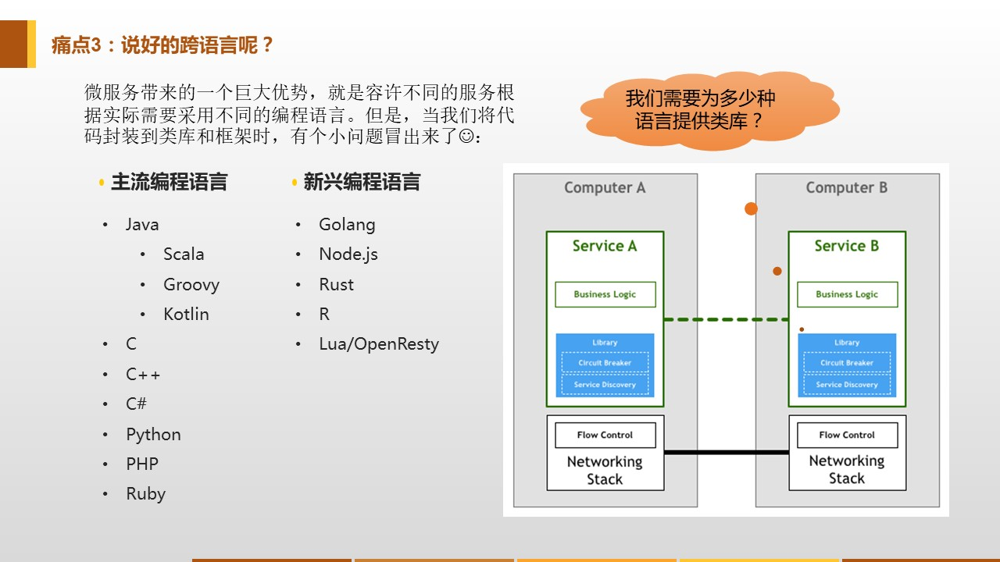

第三个痛点，跨语言。微服务在刚开始面世的时候，承诺了一个很重要的特性：就是不同的微服务可以采用自己最擅长最喜欢的最适合的编程语言来编写，这个承诺只能说有一半是OK的，但是另外一半是不行的，是假的。因为你实现的时候，通常来说是基于一个类库或者框架来实现的，一旦开始用具体编程语言开始编码的时候你就会发现，好像不对了。为什么？左边是我从编程语言排行列表列出来的主流编程语言，排在前面的几种，大家比较熟悉.后面还有几十种没有列出来，中间是新兴的编程语言，比较小众一点。

现在的问题在于**我们到底要为多少种语言提供类库和框架**。

这个问题非常尖锐，为了解决这个问题，通常只有两条路可选：

1. 一种就是统一编程语言，全公司就用一种编程语言
2. 另外一个选择，是有多少种编程语言就写多少个类库

我相信在座的如果有做基础架构的同学，就一定遇到过这个问题。

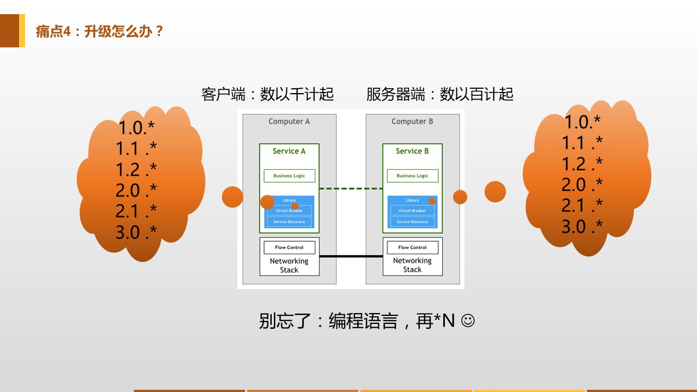

但是问题还没完，框架写好了，也有能够把各个语言都写一份。但是接下来会有第四个痛点：版本升级。

你的框架不可能一开始就完美无缺，所有功能都齐备，没有任何BUG，分发出去之后就再也不需要改动，这种理想状态不存在的。必然是1.0、2.0、3.0慢慢升级，功能逐渐增加，BUG逐渐被修复。但是分发给使用者之后，使用者会不会立马升级？实际上做不到的。

这种情况下怎么办，会出现客户端和服务器端版本不一致，就要非常小心维护兼容性，然后尽量督促你的使用者：我都是3.0了，你别用1.0了，你赶紧升级吧。但是如果如果他不升级，你就继续忍着，然后努力解决你的版本兼容性。

版本兼容性有多复杂？服务端数以百计起，客户端数以千计起，每个的版本都有可能不同。这是一个笛卡尔乘积。但是别忘了，还有一个前面说的编程语言的问题，你还得再乘个N！

设想一下框架的Java1.0客户端访问node.js的3.0的服务器端会发生什么事情，c++的2.0客户端访问golang的1.0服务器端会如何？你想把所有的兼容性测试都做一遍吗？这种情况下你的兼容性测试需要写多少个case，这几乎是不可能的。

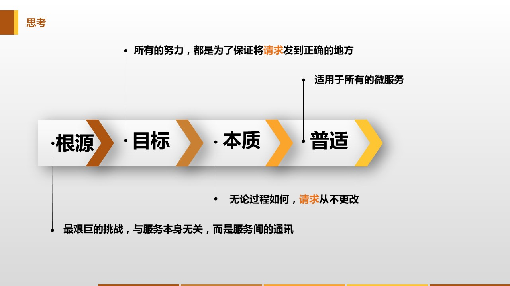

那怎么办？怎么解决这些问题，这是现实存在的问题，总是要面对的。

我们来想一想：

1. 第一个是这些问题的根源在哪里：我们做了这么多痛苦的事情，面临这么多问题，这些多艰巨的挑战，这些和服务本身有关系吗？比如写一个用户服务，对用户做CRUD操作，和刚才说的这些东西有一毛钱关系吗？发现有个地方不对，这些和服务本身没关系，而是服务间的通讯，这才是我们需要解决的问题。

2. 然后看一下我们的目标是什么。我们前面所有的努力，其实都是为了保证将客户端发出的业务请求，发去一个正确的地方。什么是正确的地方？比如说有版本上的差异，应该去2.0版本，还是去1.0版本，需要用什么样的负载均衡，要不要做灰度。最终这些考虑，都是让请求去一个你需要的正确的地方。

3. 第三个，事情的本质。整个过程当中，这个请求是从来不发生更改的。比如我们前面说的用户服务，对用户做CRUD，不管请求怎么走，业务语义不会发生变化。这是事情的本质，是不发生变化的东西。

4. 这个问题具有一个高度的普适性：所有的语言，所有的框架，所有的组织，这些问题对于任何一个微服务都是相同的。

讲到这里，大家应该有感觉了：这个问题是不是和哪个问题特别像？

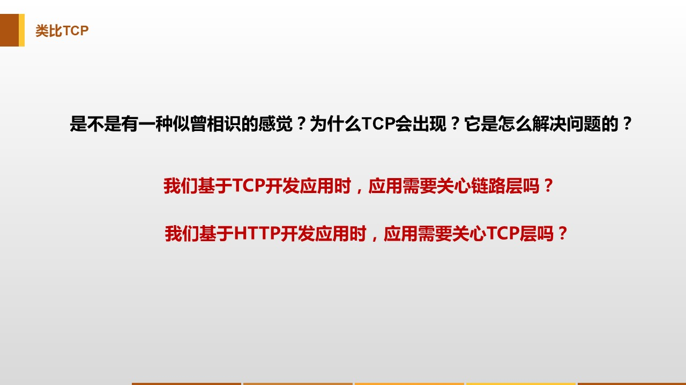

五十年前的前辈们，他们要解决的问题是什么？为什么会出现TCP，TCP解决了什么问题？又是怎么解决的？

TCP解决的问题和这个很像，都是要将请求发去一个正确的地方。所有的网络通讯，只要用到TCP协议，这四个点都是一致的。

有了TCP之后会发生什么? 我们有了TCP之后，我们基于TCP来开发我们的应用，我们的应用需要做什么事情? 我们的应用需要关心TCP层下链路层的实现吗？不需要。同理，我们基于HTTP开发应用时，应用需要关心TCP层吗？

为什么我们开发微服务应用的时候就要这么关心服务的通讯层？我们把服务通讯层所有的事情学一遍，做一遍，我们做这么多是为什么？

这种情况下，自然产生了另外一个想法：既然我们可以把网络访问的技术栈向下移为TCP，我们是可以也有类似的，把微服务的技术栈向下移？

最理想的状态，就是我们在网络协议层中，增加一个微服务层来完成这个事情。但是因为标准问题，所以现在没有实现，暂时这个东西应该不太现实，当然也许未来可能出现微服务的网络层。

之前有一些先驱者，尝试过使用代理的方案，常见的nginx，haproxy，apache等代理。这些代码和微服务关系不大，但是提供了一个思路：在服务器端和客户端之间插入了一个东西完成功能，避免两者直接通讯。当然代理的功能非常简陋，开发者一看，想法不错，但是功能不够，怎么办？

这种情况下，第一代的Sidecar出现了，Sidecar扮演的角色和代理很像，但是功能就齐全很多，基本上原来微服务框架在客户端实现的功能都会对应实现。

第一代的sidecar主要是列出来的这几家公司，其中最有名气的还是netflix。

在这个地方我们额外提一下，注意第四个，前面三个功能都是国外的公司，但是其实sidecar这个东西并不是只有国外的人在玩，国内也有厂商和公司在做类似的事情。比如唯品会，我当年在唯品会基础架构部工作的时候，在2015年上半年，我们的OSP服务化框架做了一个重大架构调整，加入了一个名为local proxy的Sidecar。注意这个时间是2015上半年，和国外差不多。相信国内肯定还有类似的产品存在，只是不为外界所知。

这个时期的Sidecar是有局限性的，都是**为特定的基础设施而设计**，通常是和当时开发Sidecar的公司自己的基础设施和框架直接绑定的，在原有体系上搭出来的。这里面会有很多限制，一个最大的麻烦是无法通用：没办法拆出来给别人用。比如Airbnb的一定要用到zookeeper，netflix的一定要用eureka，唯品会的local proxy是绑死在osp框架和其他基础设施上的。

之所以出现这些绑定，主要原因还是和这些sidecar出现的动机有关。比如netflix是为了让非JVM语言应用接入到Netflix OSS中，soundcloud是为了让遗留的Ruby应用可以使用到JVM的基础设置。而当年我们唯品会的OSP框架，local proxy是为了解决非Java语言接入，还有前面提到的业务部门不愿意升级的问题。这些问题都比较令人头疼的，但是又不得不解决，因为逼的憋出来sidecar这个一个解决方式。

因为有这样的特殊的背景和需求，所以导致第一代的Sidecar无法通用，因为它本来就是做在原有体系之上的。虽然不能单独拿出来，但是在原有体系里面还是可以很好工作的，因此也没有动力做剥离。导致虽然之前有很多公司有Sidecar这个东西，但是其实一直没怎么流传出来，因为即使出来以后别人也用不上。

这里提一个事情，在2015年年中的时候，我们当时曾经有一个想法，将Local proxy从OSP剥离，改造为通用的Sidecar。计划支持HTTH1.1，操作http header就可以，body对我们是可以视为透明的，这样就容易实现通用了。可惜因为优先级等原因未能实现，主要是有大量的其他工作比如各种业务改造，这个事情必要性不够。

所有比较遗憾，当时我们有这个想法没做实现，这是在2015年，时间点非常早的了。如果当时有实现，很可能我们就自己折腾出业界第一个service mesh出来了。现在想想挺遗憾的。

但是，不只有我们会有这想法。还有有一些人想法和我们差不多，但是比较幸运的是，他们有机会把东西做出来了。这就是第一代的Service Mesh，通用性的sidecar。

通用型的Service Mesh的出现，左边第一个Linkerd是业界第一个Service Mesh，也就是它创造了Service Mesh这个词。时间点：2016年1月15号，0.0.7发布，这是github上看到的最早的一个版本，其实这个版本离我们当时的有想法的时间点非常近。然后是1.0版本，2017年4月份发布，离现在六个月。所以说，Service Mesh是一个非常新的名词，大家没听过非常正常。

接下来是Envoy，2016年发布的1.0版本。

这里面要特别强调，Linkerd和Envoy都加入了CNCF，Linkerd在今年1月份，而Envoy进入的时间是9月份，离现在也才1个月。在座的各位应该都明白CNCF在Cloud Native领域是什么江湖地位吧？可以说CNCF在Cloud Native的地位，就跟二战后联合国在国际秩序中的地位一样。

之后出现了第三个Service Mesh，nginmesh，来自于大家熟悉的nginx，2017年9月发布了第一个版本。因为实在太新，还在刚起步，没什么可以特别介绍的。

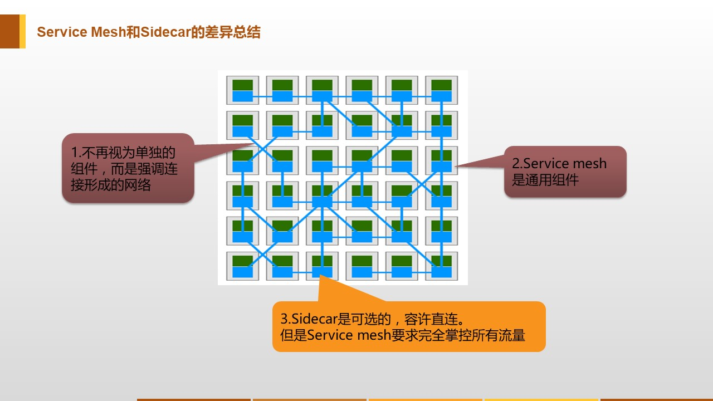

我们来看一下Service  Mesh和Sidecar的差异，前面两点是已经提到了：

1. 首先Service Mesh不再视为单独的组件，而是强调连接形成的网络
2. 第二Service Mesh是一个通用组件

然后要强调的是第三点，Sidecar是可选的，容许直连。通常在开发框架中，原生语言的客户端喜欢选择直连，其他语言选择走sidecar。比如java写的框架，java客户端直连，php客户端走sidecar。但是也可以都选择走sidecar，比如唯品会的OSP就是所有语言都走local proxy。在sidecar中也是可选的。但是，Service Mesh会要求完全掌控所有流量，也就是所有的请求都必须通过service mesh。

接下来给大家介绍Istio，这个东西我给它的评价是**王者风范**，来自于谷歌、IBM和Lyft，是Service  Mesh的集大成者。

大家看它的图标，就是一个帆船。Istio是希腊语，英文语义是"sail", 翻译过来是起航的意思。大家看这个名字和图标有什么联想？google在云时代的另外一个现象级产品，K8S，kubernete也同样起源于希腊语，船长，驾驶员或者舵手，图标是一个舵。

istio名字和图标与k8s可以说是一脉相承的。这个东西在2017年5月份发布了0.1，就在两周前的10月4号发布了0.2。大家都熟悉软件开发，应该明白0.1/0.2在软件迭代中是什么阶段。0.1大概相当于婴儿刚刚出世，0.2还没断奶。但是，即使在这么早期的版本中，我对他的评价已经是集大成者，王者风范，为什么？

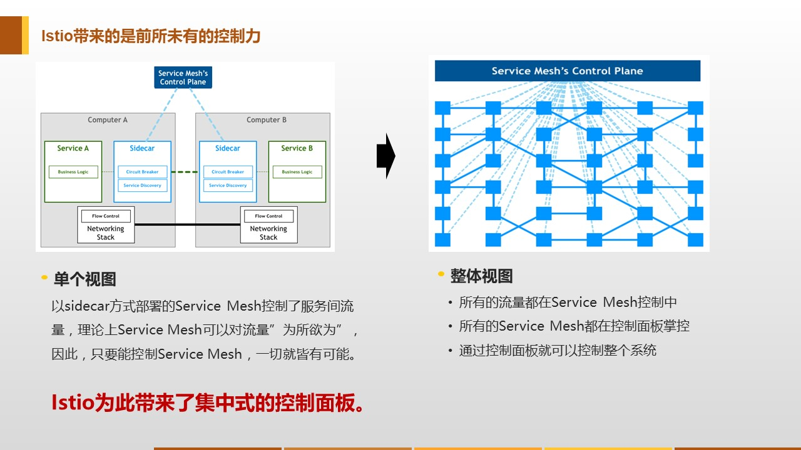

为什么说Istio王者风范？最重要的是他为Service Mesh带来了前所未有的控制力。以Sidecar方式部署的Service Mesh控制了服务间所有的流量，只要能够控制Service Mesh就能够控制所有的流量，也就可以控制系统中的所有请求。为此Istio带来了一个集中式的控制面板，让你实现控制。

左边是单个视图，在sidecar上增加了控制面板来控制sidecar。这个图还不是特别明显，看右边这个图，当有大量服务时，这个服务面板的感觉就更清晰一些。在整个网络里面，所有的流量都在Service Mesh的控制当中，所有的Service Mesh都在控制面板控制当中。可以通过控制面板控制整个系统，这是Istio带来的最大的革新。

Istio由三个公司开发，前两个比较可怕，谷歌和IBM，而且都是云平台，谷歌的云平台，IBM的云平台，尤其GCP的大名想必大家都知道。所谓出身名门，大概指的就是这个样子吧？

Istio的实力非常强，我这里给了很多的赞誉：设计理念非常新颖前卫，有创意，有魄力，有追求，有格局。Istio的团队实力也非常惊人，大家有空可以去看看istio的委员会名单感受一下。Istio也是google的新的重量级的产品，很有可能成为下一个现象级的产品。Google现在的现象级产品是什么？K8s。而Istio很有可能成为下一个K8S级别的产品。

说到应时而生，什么是势？我们今天所在的是什么时代？是互联网技术大规模普及的时代，是微服务容器如日中天的时代，是Cloud Native大势已成的时代。也是传统企业进行互联网转型的时代，今天的企业用户都想转型，这个大势非常明显，大家都在转或者准备转，但是先天不足。什么叫先天不足？没基因，没能力，没经验，没人才，而且面临我们前面说的所有的痛点。所有说Istio现在出现，时机非常合适。别忘了istio身后还有CNCF的背景，已经即将一统江湖的k8s。

istio在发布之后，社区响应积极，所谓应者云集。其中作为市面上仅有的几个Service Mesh之一的Envoy，甘心为istio做底层，而另外两个实现Linkerd/nginmesh也直接放弃和istio的对抗，选择合作，积极和istio做集成。社区中的一众大佬，如这里列出来的，都在第一时间响应，要和istio做集成或者基于istio做自己的产品。为什么说是第一时间？istio出0.1版本，他们就直接表明态度开始战队了。

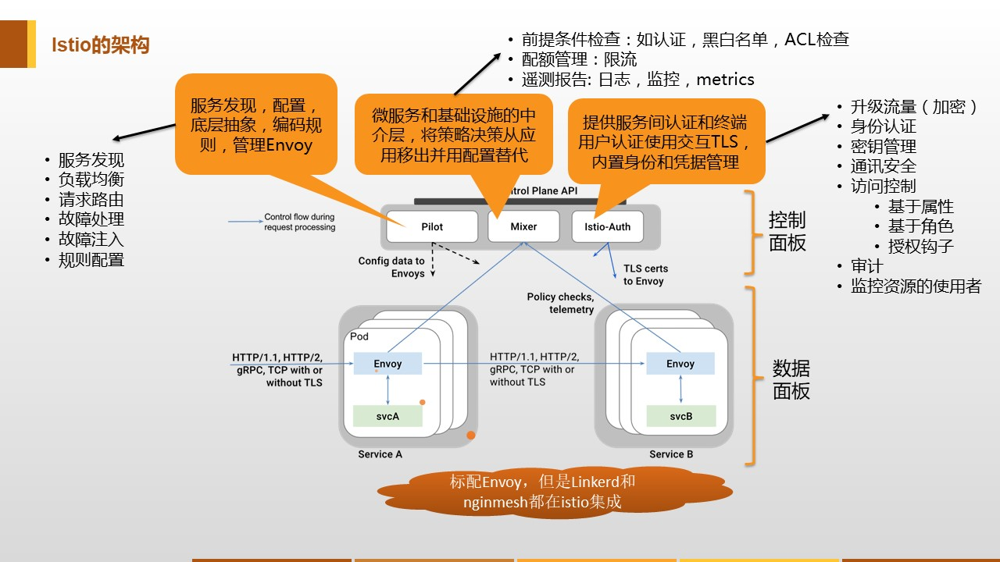

Istio的架构，主要分为两大块。下面的数据面板，是给传统service mesh的，目前是Envoy，但是我们前面也提到linkerd和nginmesh都在和istio做集成，指的就是替代Envoy做数据面板。

另外一大块就是上面的控制面板，这是istio真正带来的内容。主要分成三大块，图中我列出了他们各自的职责和可以实现的功能。

因为时间有限，不在今天具体展开。

这里给大家留一个地址，是我之前做的一次线上分享，对Istio的详细介绍，内容比较多，大家看看仔细看看。

- [万字解读:Service Mesh服务网格新生代--Istio](https://mp.weixin.qq.com/s?__biz=MzA3MDg4Nzc2NQ==&mid=2652136078&idx=1&sn=b261631ffe4df0638c448b0c71497021&chksm=84d532b4b3a2bba2c1ed22a62f4845eb9b6f70f92ad9506036200f84220d9af2e28639a22045&mpshare=1&scene=1&srcid=0922JYb4MpqpQCauaT9B4Xrx&pass_ticket=DQ%2B13yxFroDiLJgSF3xOEOhvowBRom2sE4accBhVABdFMCE9q3EC/FqN6fLNDggP#rd)

然后我们还组织了一个service mesh的技术社区，对istio的文档进行了翻译。

- [Istio官方文档中文翻译](http://istio.doczh.cn/)

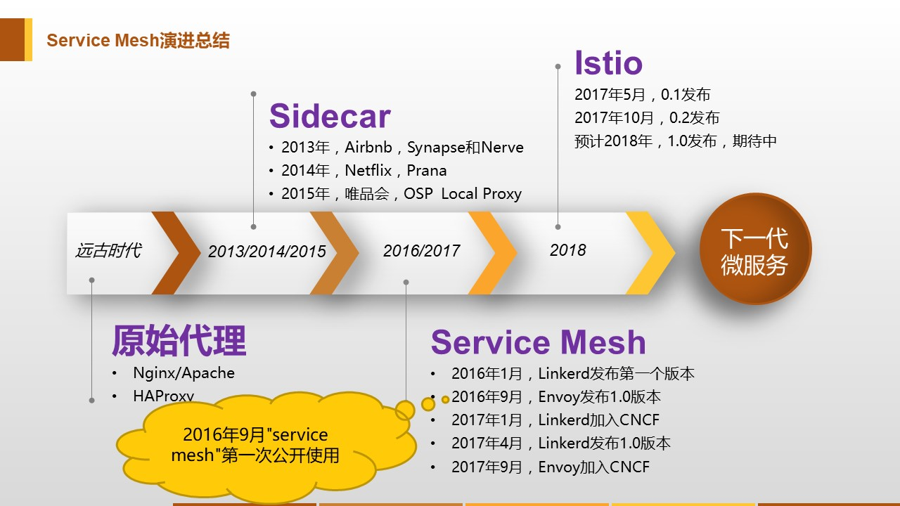

总结一下，service mesh这是一步一步过来的: 从原始的代理，到限制很多的Sidecar，再到通用性的Service  Mesh，然后到加强管理功能的Istio，在未来成为下一代的微服务。

注意，离service mesh这个词汇出现的时间点，也才一年。

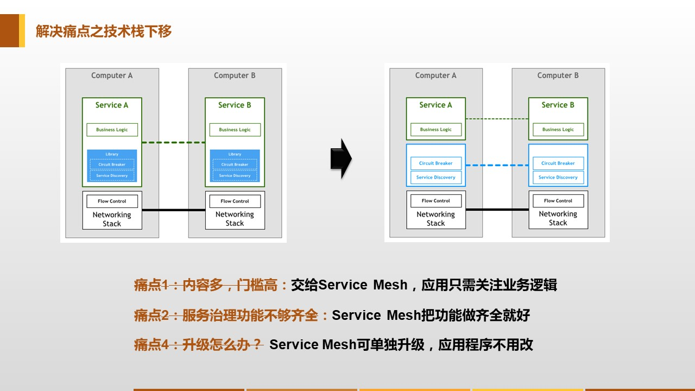

前面三个痛点都被解决了，有了Service Mesh之后这些问题都不是问题了。升级的痛点怎么解决？Service Mesh是一个独立进程，可单独升级，而应用程序不用改。

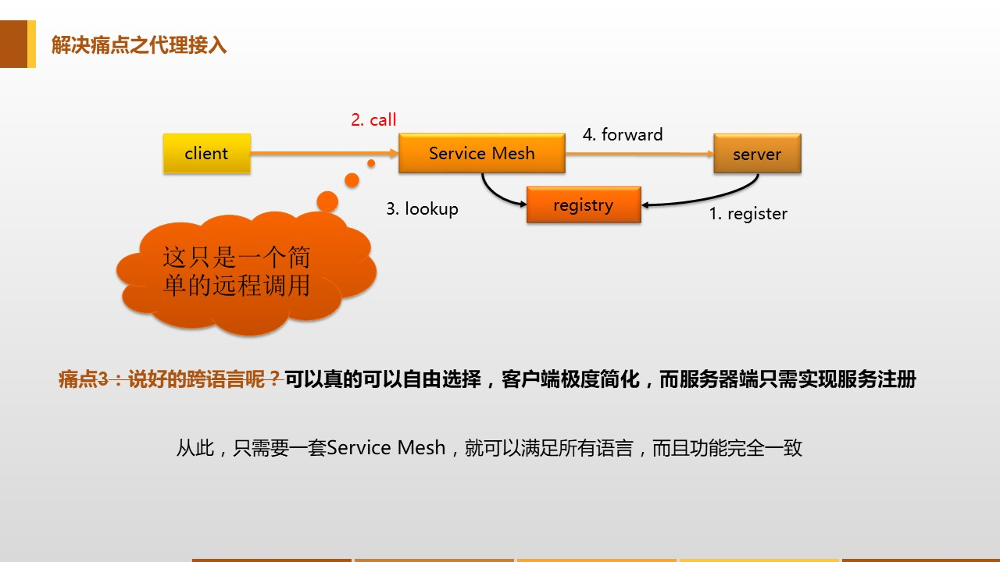

service mesh是以远程调用的方式让客户端接入，只要能发出请求，简单发给service
mesh就可以。客户端极度简化，对于典型的rest请求，几乎所有的语言都有完善的支持。而服务器端只要做一个事情，服务注册。这样对于多语言的支持，就变得非常舒服了。现在终于可以真正的自由选择编程语言。

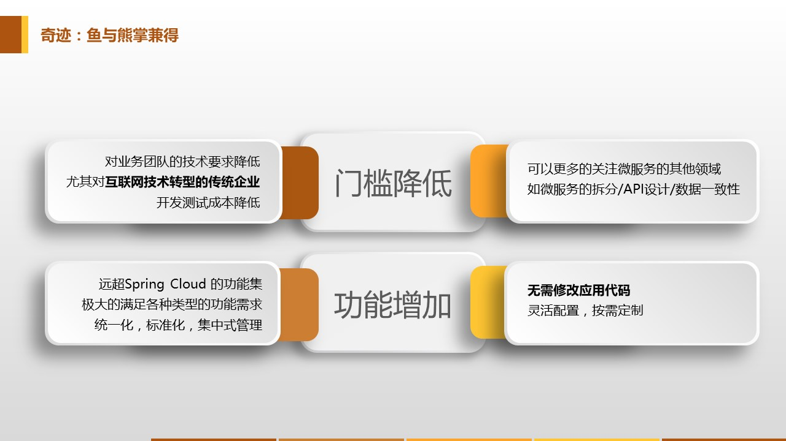

这里有一个奇迹，鱼与熊掌兼得：同时实现降低门槛，功能增加。有些信奉质量守恒的同学会感觉不科学，注意能同时实现这两个改进的原因，是把工作量最大最辛苦的事情都交给了Service  Mesh。而Service Mesh是通用的，可以反复重用的。

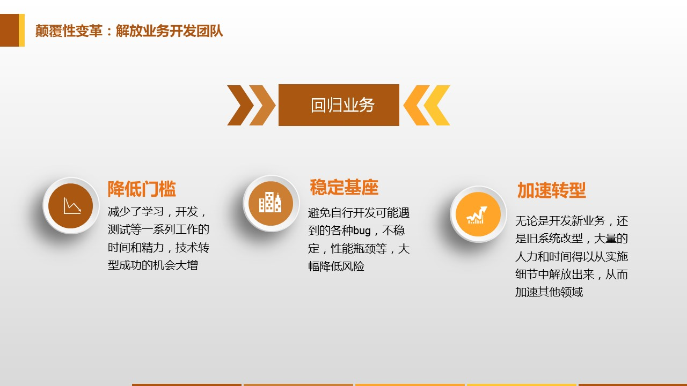

Service mesh为业务开发团队带来的变革：降低入门门槛，提供稳定基座，帮助团队实现技术转型。最终达到的目的是，让业务开发团队从微服务实现的具体技术细节中解放出来，**回归业务**。

第二个变革，是对运维管理团队的强化，这里如果有做运维的同学，你们可以认真思考一下：如果有了service mesh，你们对系统的管理和控制力会有多大的？注意很多功能的实现已经不再和应用有关，都在移到service mesh中，而service mesh通常是在运维的掌控中。

service mesh对于新兴小众语言是极大的利好。对于新的语言来说，在和传统的主流编程语言竞争时，最痛苦的事情是什么？是生态，比如各种类库，各种框架。在微服务这个领域，新兴小众语言想和Java等比拼，非常的难：这是用自己的劣势对上别人的优势。而有了Service Mesh之后，小众语言就有机会避开这个弊端，再不用和Java比拼生态，而是充分发挥自己的语言特点，做自己最擅长的领域。

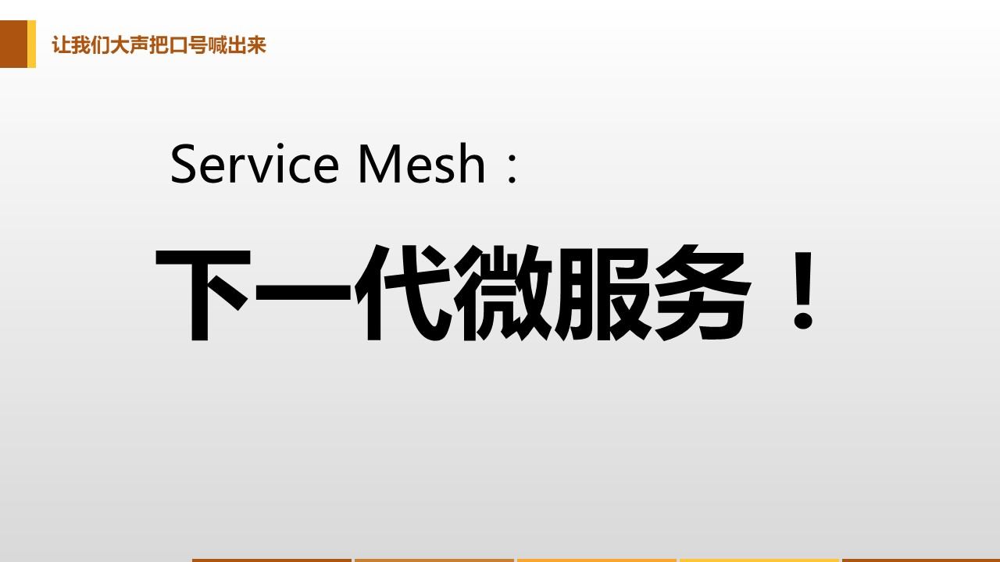
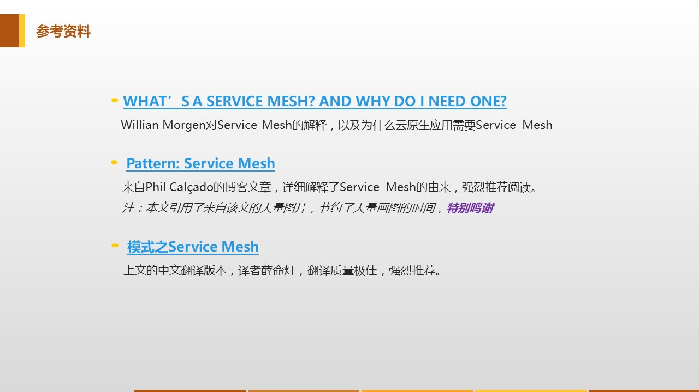

今天的内容基本上到这儿了，最后给两个资料，这两个文章，一个是对Service Mesh的解释，一个是详细介绍Service Mesh的由来，大家如果回去之后可以详细看一下。尤其第二个文章，我的PPT援引了里面的很多图片。英文不是特别好的同学可以看一下中文翻译版本，作者翻译质量非常高。

最后，我们拉了一个service mesh的技术社区，有一个微信群。主要是因为Service Mesh这个技术实在是太新了，就像刚才调查的只有三个同学之前有听过。所以现在我们遇到一个大的问题：我们想交流的时候找不到人。因此我们建立了这个群，如果大家愿意对Service Mesh技术有兴趣的话，可以直接加到群来。这是一个纯技术的群，只讨论技术的东西。

然后我们的service mesh的技术社区目前正在准备中，不久将亮相，大家可以稍后关注。

我们今天的内容就到这里结束，非常感谢大家！
